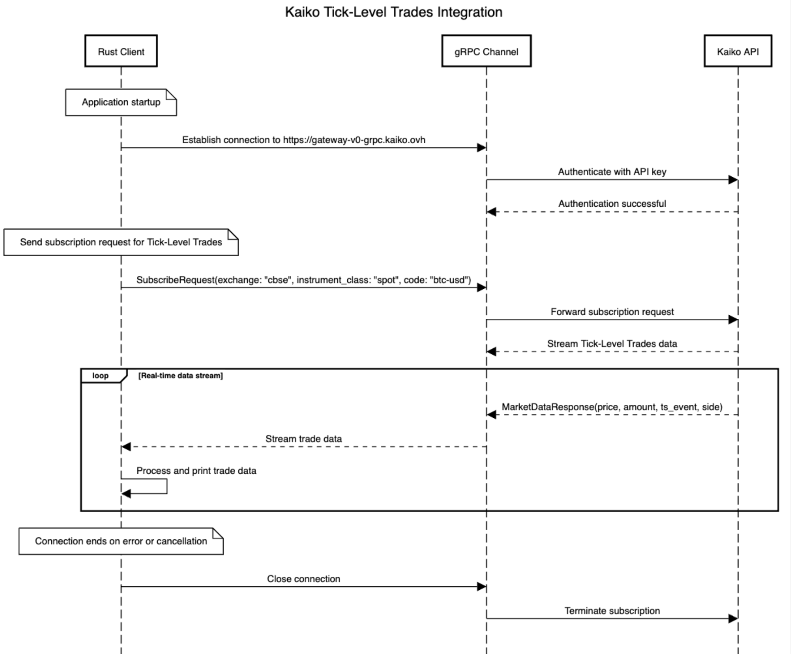

# kaiko_stream

### Start

```shell
# run build scripts to build proto
cargo build
# start the project
cargo run
```

### Sequence Diagram 



```
title Kaiko Tick-Level Trades Integration

participant Rust Client
participant gRPC Channel
participant Kaiko API

note over Rust Client: Application startup
Rust Client->gRPC Channel: Establish connection to https://gateway-v0-grpc.kaiko.ovh
gRPC Channel->Kaiko API: Authenticate with API key
Kaiko API-->gRPC Channel: Authentication successful

note over Rust Client: Send subscription request for Tick-Level Trades
Rust Client->gRPC Channel: SubscribeRequest(exchange: "cbse", instrument_class: "spot", code: "btc-usd")
gRPC Channel->Kaiko API: Forward subscription request
Kaiko API-->gRPC Channel: Stream Tick-Level Trades data

loop Real-time data stream
    Kaiko API-->gRPC Channel: MarketDataResponse(price, amount, ts_event, side)
    gRPC Channel-->Rust Client: Stream trade data
    Rust Client->Rust Client: Process and print trade data
end

note over Rust Client: Connection ends on error or cancellation
Rust Client->gRPC Channel: Close connection
gRPC Channel->Kaiko API: Terminate subscription
```
